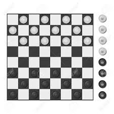

# P4: Refactoring - Javier Diaz Lopez (Parte 2: Coordenada genérica)
  * ## Anotaciones alumno: 
  > El código la clase coordenada esta acoplado y se ha implementado una nueva clase coordenada generica en el paquete utils para así	descolapsar una jerarquia.

## Modelo del Dominio
Como jugar: https://www.youtube.com/watch?v=yFrAN-LFZRU

### Instrucciones de entrega

Entrega de un proyecto público en git varias ramas:

* **master**, con:
    * Modelo del dominio.
    * Requisitos: Puedes encontrar los requisitos en la carpeta /Damas de este mismo repositorio.
    * Código inicial: https://github.com/ijavidilo/p3-damas/tree/unitTestWithMockito/solution.Java
* **nullObjectPattern**, con:
    * solución en Java o similar (fuertemente tipado) basada en el capitulo de Diseño y el proyecto ticTacToe
        * Modelo del Dominio: https://github.com/ijavidilo/p4-refactoring/tree/master#modelo-del-dominio
        * Implementación: https://github.com/ijavidilo/p4-refactoring/tree/nullObjectPattern/solution.Java/src/main/java/usantatecla/draughts
        * Test unitarios: https://github.com/ijavidilo/p4-refactoring/tree/nullObjectPattern/solution.Java/src/test/java/usantatecla/draughts  
>* **genericCoordinate**, con:
>    * solución en Java o similar (fuertemente tipado) basada en el capitulo de Diseño y el proyecto ticTacToe
>        * Modelo del Dominio: https://github.com/ijavidilo/p4-refactoring/tree/master#modelo-del-dominio
>        * Implementación: https://github.com/ijavidilo/p4-refactoring/tree/genericCoordinate/solution.Java/src/main/java/usantatecla/draughts
>        * Test unitarios: https://github.com/ijavidilo/p4-refactoring/tree/genericCoordinate/solution.Java/src/test/java/usantatecla/draughts 

Master Cloud Apps curso 2020/21 [MasterCloudApps](https://www.codeurjc.es/mastercloudapps/).